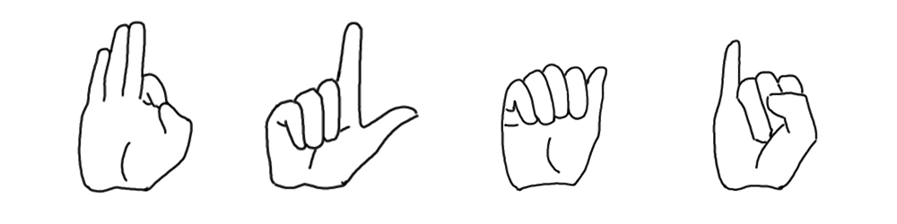

Illustration by [Stefanie Jany](https://www.linkedin.com/in/stefanie-jany-53383b197/)

'Learning Sign Language' is currently my main active project and part of my [European Project Semester](http://www.europeanprojectsemester.eu/).
  
The main goal is to build the technical framework for a web application, that allows its users to learn the basics of German Sign Language (primarily the signed alphabet),
by providing live feedback on signs shown to a webcam and tailoring a learning program to the individual user's progress.
  
To be able to give feedback on the sign-inputs made by the user, we are developing and evaluating a Deep Learning pipeline for realtime gesture recognition.
Currently we are testing the approach of using the [mediapipe handpose solution](https://google.github.io/mediapipe/solutions/hands.html) as a pre-processing step that provides robust three-dimensional data for a deep Self Normalizing Neural Network to interpret and helps overcome challenges regarding diversity in signers, lighting or backgrounds that would come with creating a dataset to train an image-recognition-based solution from scratch.
  
However, we also hope to be able to release a high quality, diverse and open source dataset of the German Sign Language alphabet towards the end of our project.
