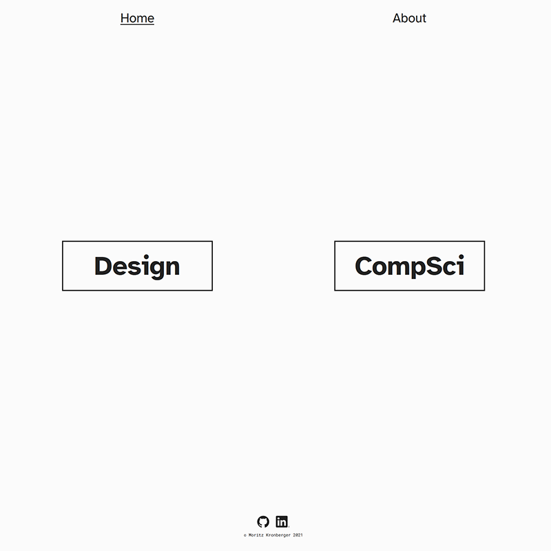

This portfolio website is implemented as a git-based Headless CMS based on the Nuxt Content module. A strong focus with the development of this project was responsive design, SEO and fast serverside rendered content.
The side is hosted on netlify with an automated build process based on the project's git repository making it an easy to use CMS.

