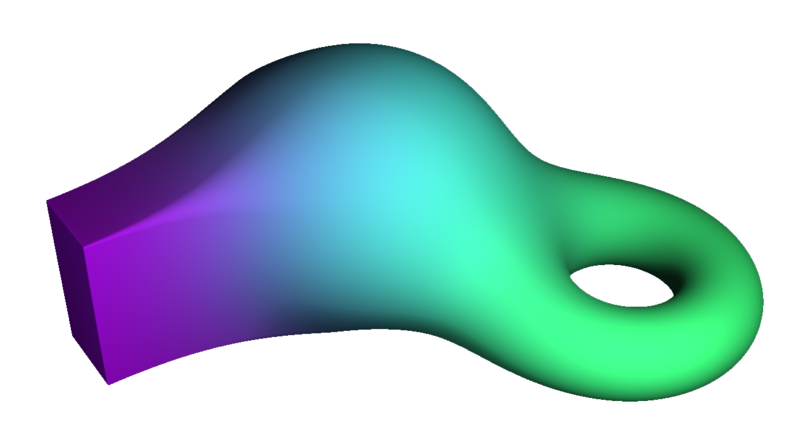

The goal of this project was to improve my mathematical understanding of the basic render pipleline starting from the initial rasterization all the way to parts of global illumination.

Raymarching as a rendering technique provided lots of opportunities for further exploration of mathematical topics like Constructive Solid Geometry or Smoothing Functions.

Apart from the render engine itself, implemented as a Compute Shader in Unity, this project also features a [seminar paper](https://github.com/MoritzKronberger/Raymarching/blob/main/Doc/Documentation.pdf) [german] diving deeper into the underlying math, aided by a browser based [visualization](https://www.hs-augsburg.de/homes/mokro/mathematik/visualisierung_raymarching/).

