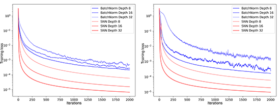

Comparing training error on MNIST (left) and CIFAR10 (right) ([Klambauer et al. 2017](https://arxiv.org/pdf/1706.02515.pdf))

The seminar paper static_['Methods of Neural Network Layer-Input-standardization'](/pdfs/Techniken_zur_Standardisierung_der_Schicht-Inputs_Neuronaler_Netze.pdf)
[German] takes a deep-dive into the various forms of normalization
that can be used to mitigate the problems of Vanishing or Exploding Gradient and high sensitivity to learning rate selection, that come with deep Neural Network architectures, while simultaneously speeding up their training.
  

Starting from the intuition of Internal Covariate Shift (ICS) and an overview of the resulting industry standard, Batch Normalization, the paper explores the underlying math behind a newer and more
computationally efficient standardization method: Self Normalizing Neural Networks.
  

Finally, new research into the viability of ICS as an explanation for the success of neural activity standardization gives us an outlook towards even lighter weight normalization techniques.
