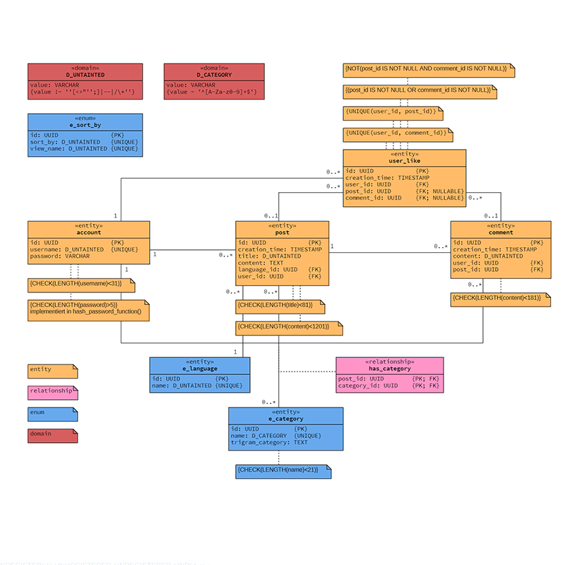

The fullstack webapplication 'Snippets' allows its users to share short code snipptes in a Twitter-like format. Like most social media platforms users interact with posts through likes and comments.

The database features a error tolerant, searchable tag system for posts, implemented via a trigram index.
A big technical focus of this project was the use of stored procedures to provide REST-like CRUD functionality on the database level.
The database is running as a docker instance and can be easily accesed via a dockerized version of PgAdmin.

