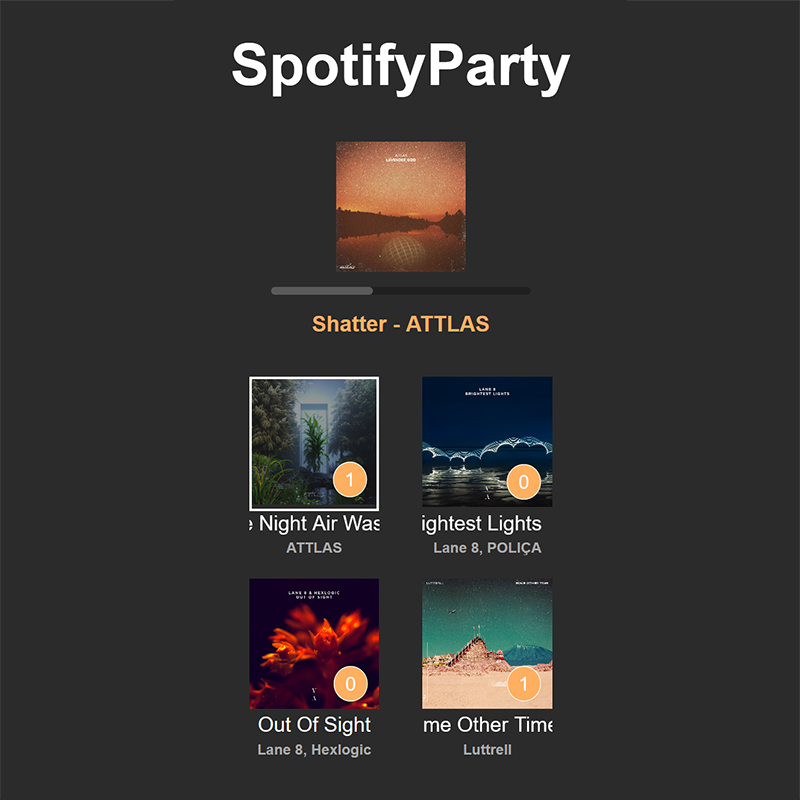

This Django webapplication allows users to connect in live sessions, which are sharable with 'room-code'-system and makes it possible to let session guests voteon the next song to be played from the host's chosen Spotify playlist.
Within a session the progress of the currently playing song is tracked to give an indication of the remaining time to vote. The most voted song will automatically be played next by the host's spotify account on the selected device.

The project consists of a Django backend with an SQLite database and a dockerized Redis server for websocket-caching.
Live sessions are made possible by the websocket functionality provded by the the Django Channels plugin.
For simplycity the application handles authenticaton via a the same Spotify-OAuth, that makes interactions with the users's Spotify profile possible.

